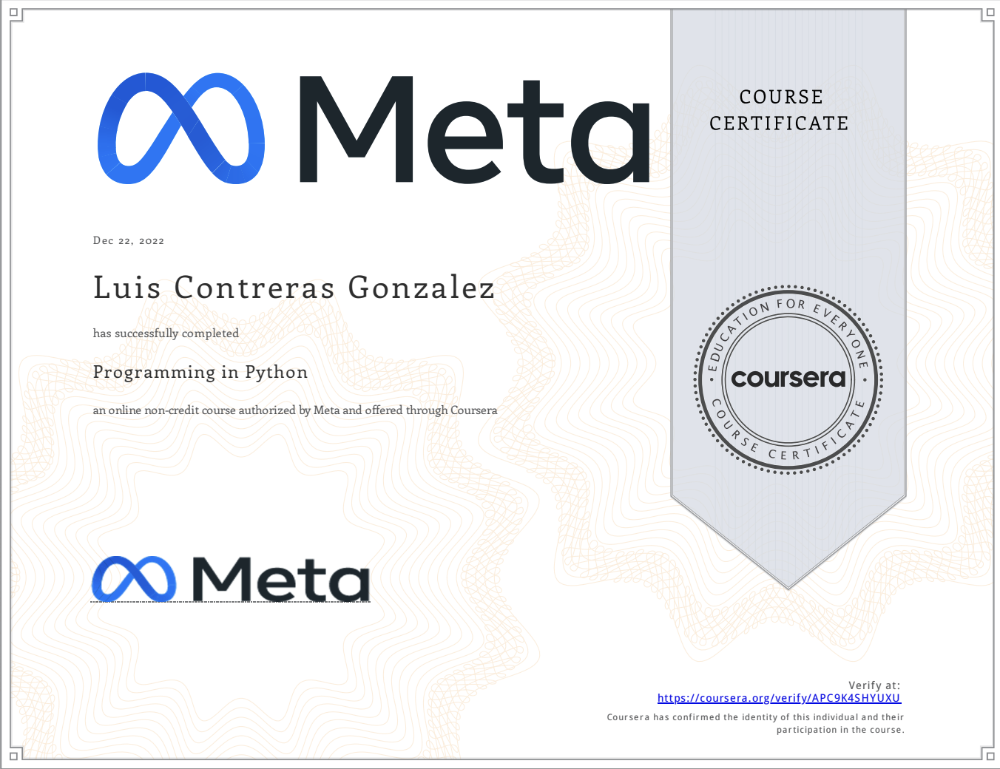

# Programming with Python by Meta

This project contains the problem sets and projects from [Meta Programming with Python](https://www.coursera.org/learn/programming-in-python?specialization=meta-back-end-developer) 

For more certifications and complete profile please check my LinkedIn page: https://www.linkedin.com/in/luis-contreras-gonzalez/
